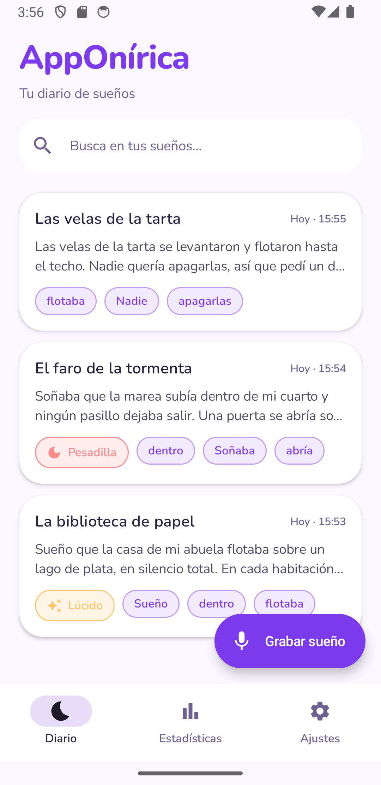
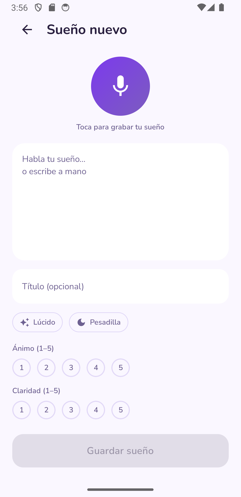
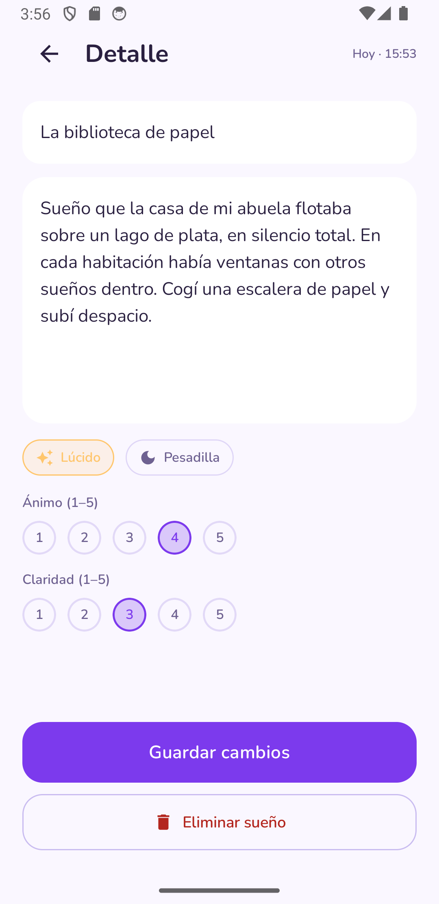
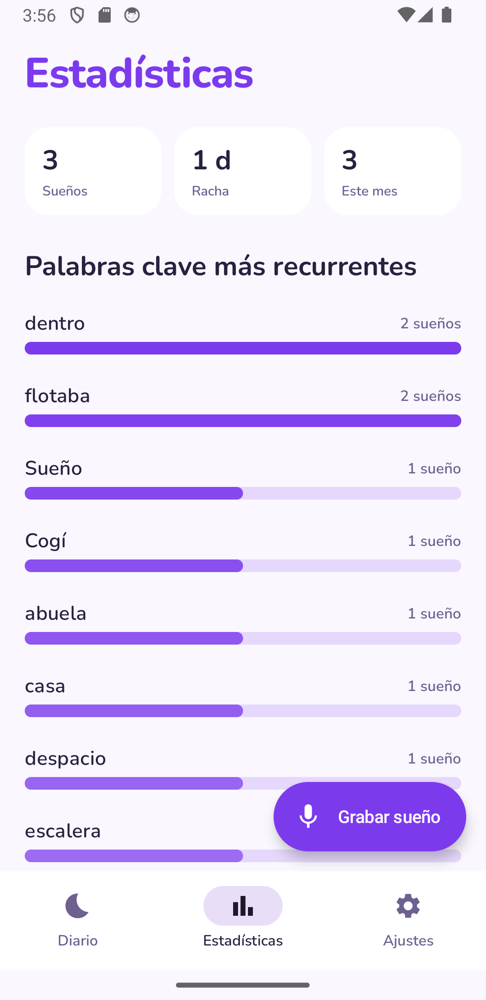
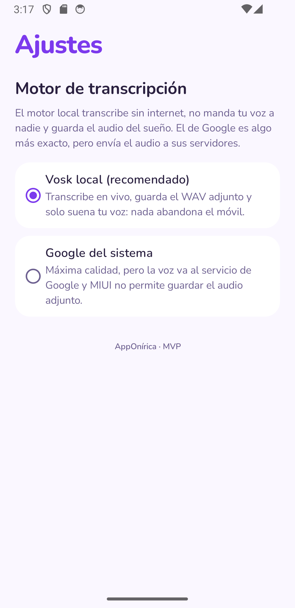

# 🌙 AppOnírica

> Dream journal for Android with voice capture and **100% offline transcription** — your voice, your text and your audio never leave the phone.

    

[**Español**](README.md) · English

An Android dream-journal app that **I personally use every day on my own phone**: right after waking up I record a voice note, a local speech engine transcribes it without any internet connection, and the dream is saved with a title, markers (lucid/nightmare), mood and clarity. Keywords are extracted automatically with a hand-written Spanish stemmer and accumulated to surface recurring themes. Built end to end by a single person (with AI-assisted development), no Hilt and no Firebase.

## Why it exists

It's the app I wanted for myself: a dream journal with zero friction (voice is the natural way to capture a dream the moment you wake up), fully private, with no cloud dependencies. The code lives here as a portfolio piece: read it, build it and use it as a reference.

## 🔒 Privacy: your voice never leaves the phone

By default the app transcribes with a **local engine** ([Vosk](https://alphacephei.com/vosk/), small-es model bundled in the APK): neither audio nor text is ever sent to a server; there is no telemetry, no analytics, no accounts and no network requests in the app's normal flow.

| | Local Vosk (default) | System Google (optional) |
|---|---|---|
| Internet | Not needed | Required |
| Privacy | Nothing leaves the phone | Voice goes to Google servers |
| Voice attachment | Yes (dream WAV) | No (some ROMs don't share the mic) |
| Startup beep | No | Yes |

The Google engine is an **optional** alternative the user picks in Settings; it is never the default engine nor a data channel of the app.

## ✨ Screenshots

<table>
  <tr>
    <td></td>
    <td></td>
    <td></td>
  </tr>
  <tr>
    <td><i>Journal with keywords</i></td>
    <td><i>Voice capture</i></td>
    <td><i>Dream detail with voice note</i></td>
  </tr>
  <tr>
    <td></td>
    <td></td>
  </tr>
  <tr>
    <td><i>Statistics (one entry per dream)</i></td>
    <td><i>Transcription engine picker</i></td>
  </tr>
</table>

## What each dream stores

- Transcribed text (hand-editable) + optional title.
- Voice-note audio (WAV) with a player in the detail screen.
- Markers: Lucid / Nightmare, mood and clarity (1–5).
- Date + origin (voice or keyboard), Spanish-stemmed keywords, full-text search (FTS4), and statistics (total, streak, monthly buckets and top dream signs — each word counts at most once per dream).

## Stack

- Native Android: Kotlin 2.0.21 + Jetpack Compose (Material 3) + Navigation Compose.
- Room (FTS4) + DataStore, coroutines/Flow, manual DI (no Hilt).
- Offline transcription: `vosk-android 0.3.47` with `vosk-model-small-es-0.42` (Apache 2.0) in `assets` — the APK weighs ~96 MB because of the model.
- Toolchain: Gradle 8.9, AGP 8.7.3, JDK 17, minSdk 26, targetSdk/compileSdk 35.

## Building and trying it

```bash
./gradlew :app:assembleDebug        # APK at app/build/outputs/apk/debug/
./gradlew :app:testDebugUnitTest    # keyword extractor tests (JVM)
```

Requirements: JDK 17 and an Android SDK (AGP 8.7.3). Install the APK on a real device for real voice; on an emulator the offline engine works just the same (CPU) although the test environment provides no real voice.

## Structure

```
app/src/main/java/com/diegovillena/apponirica/
├── core/
│   ├── audio/      EscritorWav (16 kHz mono PCM WAV)
│   └── keywords/   StemmerEspanol, ExtractoraPalabrasClave, StopwordsEspanol
├── data/
│   ├── db/         Room: Dream+FTS4, PalabraClave, links, DAOs
│   └── repo/       RepositorioSuenos (save/delete recomputes keywords)
├── transcription/  Transcriptor (contract) · TranscriptorVosk · TranscriptorSistema
└── ui/             theme, capture, detail, journal, statistics, settings
```

## Status and roadmap

- **Now: a personal app running on my phone.** MVP skeleton → phase 2 (offline Vosk engine with WAV attachment and engine picker) → usability and data polish (presence-based statistics, list refresh, scrollable forms).
- Optional later work: quick-capture widget on waking · recurring-dream detection · export/import · PIN · reminders · higher-quality engine (sherpa-onnx / Whisper). See `docs/investigacion.md` and `docs/plan-fase2.md`.

## Honest limitations

- The small model transcribes with roughly 11–16% WER: the field is hand-editable and the Google engine is the quality alternative.
- No export/import yet: dreams live in the phone's local database.
- Personal-use app: not released under an open-source license (all rights reserved, see below).

## License

© 2026 Diego Villena. All rights reserved. The code is published on GitHub as a portfolio and reference piece: you may read it, build it and try it, but not redistribute or reuse it without permission. The app is provided "as is", without warranty of any kind; your dream data is yours and lives on your device.